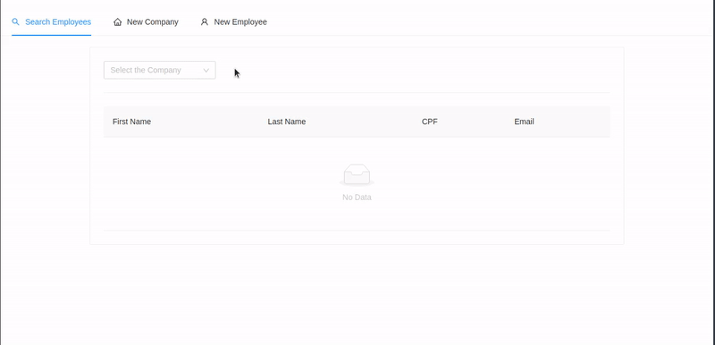
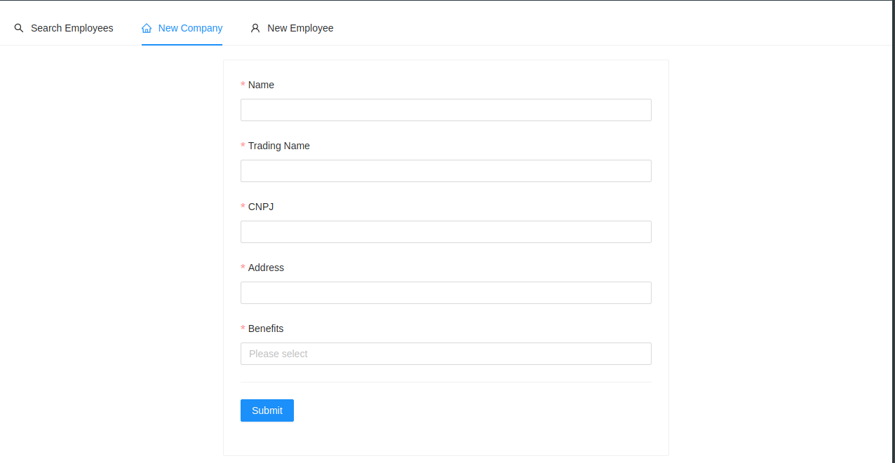
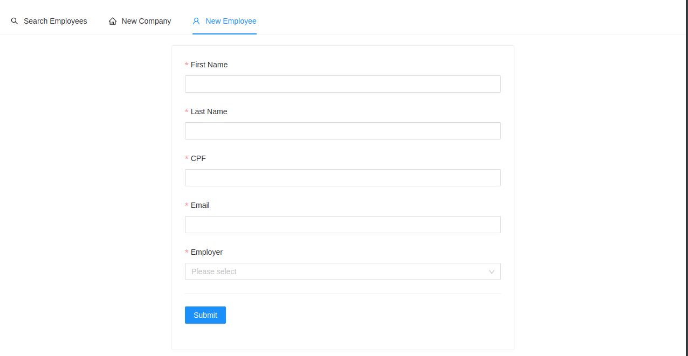

# Flash

> Developed using NextJS, Apollo Server/Client, Mongoose and Ant Design.

## Features

This website has 3 main pages:

### Search Employees



### New Company



### New Employee



## Getting Started

First of all, be sure to install Node, MongoDB and the project requirements (with `npm install`)

After that, create a `.env.local` file, with the Environment Variables as shown below

```shell
# This values can be kept for the development env.
NEXT_PUBLIC_APP_URI="http://localhost:3000"
NEXT_PUBLIC_GRAPHQL_SERVER_PATH="/api/graphql"

# Change the value accordingly to your MongoDB database URI.
MONGODB_URI="<your_MongoDB_URI>"
```

To run the project in development mode:

```shell
npm run dev
```

## Project's Structure

NextJS allows us to build small apps with an unified front-end/back-end folder structure.

### Front-End

The `/src/pages/` folder works as a router, containing all the pages.

> The `index.tsx` file corresponds to the `/` end-point, `newCompany.tsx` to `/newCompany` and so on.

Some of the TSX components have been modularized and can be found in `/src/components/`.

The ApolloClient definition file can be found in `lib/apolloClient.tsx`, and its queries in `src/graphql/queries`.

### Back-End

The Apollo Server is defined in `/src/pages/api/graphql.ts`. Its WEB client can be accessed using the `/api/graphql`
route on the browser.

The schema definition and its resolvers were placed on `/src/graphql/`

The mongoose ORM setup file can be found on `/lib/mongoose.ts`, whereas the models were placed on `/src/models`
